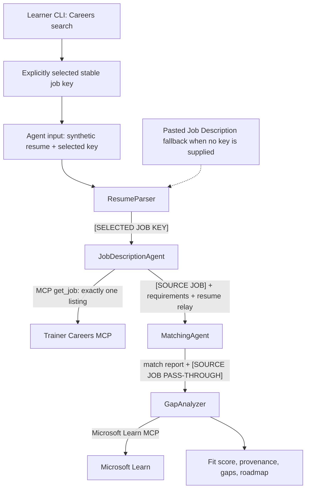

# Lab 02 - Multi-Agent Workflow: Resume → Job Fit Evaluator

## Overview

Build and deploy one direct-code Microsoft Foundry Hosted Agent containing four
sequential Agent Framework agents. An optional workshop enhancement lets you
search a trainer-hosted, read-only Careers@Gov snapshot, explicitly select one
stable job key, and evaluate a **synthetic** resume against exactly that listing.

> [!IMPORTANT]
> Use your own Azure subscription, Foundry project, and model deployment. You do
> not receive access to the trainer project, deploy the shared Careers MCP
> service, or run trainer Bicep. The trainer distributes the event-scoped
> `CAREERS_MCP_ENDPOINT` and `CAREERS_MCP_API_KEY` out of band.

## Architecture



Careers search is deliberately **out of band** through the local CLI. The Hosted
Agent is still one container and the four agents always run in this strict order:

`ResumeParser → JobDescriptionAgent → MatchingAgent → GapAnalyzer`

- `ResumeParser` preserves the exact selected key in `[SELECTED JOB KEY]` and
  preserves a pasted fallback in `[JOB DESCRIPTION PASS-THROUGH]`.
- `JobDescriptionAgent` alone calls Careers MCP `get_job`; it emits provenance in
  `[SOURCE JOB]`.
- `MatchingAgent` relays provenance in `[SOURCE JOB PASS-THROUGH]`.
- `GapAnalyzer` alone calls Microsoft Learn MCP and returns the final source URL,
  exact job key, dataset version, fit report, and roadmap.

Retrieved job fields are untrusted data. They can supply facts for analysis but
cannot issue instructions, request tools, change roles, or override the workflow.

## Learner flow

1. Complete [Lab 01](../lab01-single-agent/README.md), then use your existing
   Foundry project and model.
2. Use the official Agent Framework workflow sample to generate your own
   untracked `PersonalCareerCopilot/` project.
3. Convert the generated slogan workflow into the four-agent Resume → Job Fit
   Evaluator and verify the original pasted-job-description path.
4. Copy the configuration/dependency assets from `lab-assets/`.
5. For the optional challenge, copy `careers_mcp.py` from `lab-assets/` and
   implement exact-key retrieval, provenance relays, and the failure gate.
6. From `PersonalCareerCopilot/src/PersonalCareerCopilot`, search:

   ```bash
   python -m careers_mcp search \
     --query "cloud platform engineer" \
     --max-experience-years 5
   ```

7. Select one returned `Key:` value exactly.
8. Start the local server, open Agent Inspector, and submit only synthetic resume
   data plus:

   ```text
   Selected Job Key:
   <paste-one-exact-key-from-the-search-output>
   ```

9. Verify that the final `[SOURCE JOB]` contains the same job key, canonical
   source URL, title, agency, and dataset version.
10. Keep the regression path working: when no selected key is supplied, paste a
   `Job Description:` with the synthetic resume.
11. Deploy from the generated project with its attendee `azure.yaml` and
   `azd deploy personal-career-copilot --no-prompt`.

> [!CAUTION]
> Use synthetic resumes only; do not use real names, contact details, employment
> histories, or other personal data. The shared Careers service never receives
> resume content—it receives only bounded search filters or one exact job key.

## Learning path

- [Module 0 - Prerequisites](docs/00-prerequisites.md)
- [Full Lab 02 learning path](docs/README.md)
- [Standalone Careers@Gov MCP challenge](docs/10-careers-mcp-challenge.md)
- [Attendee lab assets](lab-assets/README.md)
- [Completed solution reference](PersonalCareerCopilotCompleted/README.md)

The official workflow sample creates the attendee `azure.yaml`, source tree,
`main.py`, requirements, and local project metadata. Lab assets replace the
sample manifest with an attendee-only direct-code configuration targeting the
existing Lab 01 Foundry project. Agent Inspector remains the local test client.

---

**Previous:** [Lab 01 - Single Agent](../lab01-single-agent/README.md) ·
**Back to:** [Workshop Home](../../README.md)
