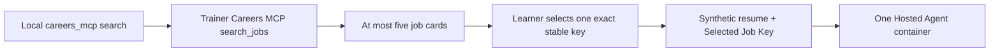
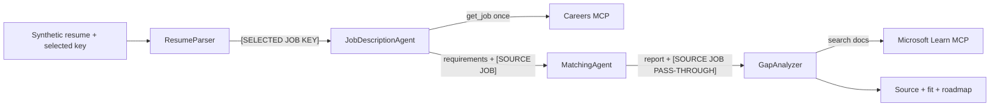

# Module 1 - Understand the Architecture

⏱️ ~10 min

## Two-step learner experience

Job discovery is intentionally outside the one-shot agent workflow:

The model never chooses among search results autonomously. You copy one exact
`Key:` value from the CLI into the agent input.

## Runtime workflow

All four agents run **sequentially in one Hosted Agent container**:

| Agent | Responsibility |
|---|---|
| `ResumeParser` | Parses the synthetic resume; copies an exact selected key to `[SELECTED JOB KEY]`; preserves a pasted JD in `[JOB DESCRIPTION PASS-THROUGH]` |
| `JobDescriptionAgent` | If a key exists, calls Careers MCP `get_job` exactly once and only for that key; otherwise uses the pasted-JD fallback; emits `[SOURCE JOB]` |
| `MatchingAgent` | Compares parsed resume evidence with requirements and relays source metadata in `[SOURCE JOB PASS-THROUGH]` |
| `GapAnalyzer` | Builds the roadmap, calls Microsoft Learn MCP for High/Medium gaps, and restores `[SOURCE JOB]` in the final response |

Only `JobDescriptionAgent` has the Careers `get_job` tool. Search remains in the
local CLI. Only `GapAnalyzer` calls Microsoft Learn MCP.

## Labeled relay contract

With `context_mode="last_agent"`, each executor sees only its immediate
predecessor. These labels keep routing deterministic:

- `[SELECTED JOB KEY]` — exact learner selection relayed from `ResumeParser` to
  `JobDescriptionAgent`; case and punctuation must not change.
- `[SOURCE JOB]` — title, agency, canonical source URL, exact job key, and dataset
  version emitted by `JobDescriptionAgent`.
- `[SOURCE JOB PASS-THROUGH]` — verbatim source block relayed by
  `MatchingAgent` so `GapAnalyzer` can include provenance in the final response.
- `[JOB DESCRIPTION PASS-THROUGH]` — complete pasted description used only when
  no selected key is supplied.

## Trust and privacy boundaries

The MCP snapshot contains external job text. The implementation marks it as
**untrusted data**. Embedded prompts, commands, role changes, or tool requests are
ignored; fields are used only as job facts. A failed retrieval is reported and
must never produce fabricated job data.

The Careers service receives only bounded search/filter arguments or one exact
job key. The synthetic resume goes to the learner's agent/model, not to the
shared Careers service.

## Pasted-JD fallback

If `Selected Job Key:` is absent and `Job Description:` is present, the workflow
keeps the original path and uses only that pasted text. If both are absent, it
asks the learner to search and select a job. If a selected key is present but
retrieval fails, it reports failure rather than silently switching to the pasted
JD.

---

**Previous:** [00 - Prerequisites](00-prerequisites.md) ·
**Next:** [02 - Scaffold the Attendee Project →](02-scaffold-multi-agent.md)
