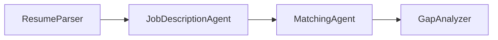

# Module 4 - Orchestration & Labeled Relays

⏱️ ~10 min

## Strict sequential workflow

The implemented graph has one start executor, one output executor, and exactly
three edges:



```python
WorkflowBuilder(
    start_executor=resume_executor,
    output_executors=[gap_executor],
).add_edge(
    resume_executor, jd_executor
).add_edge(
    jd_executor, matching_executor
).add_edge(
    matching_executor, gap_executor
)
```

All four agents execute in this order inside a single Hosted Agent container.
Careers job discovery is not another agent stage: the learner runs the CLI
before submitting the request.

## Why labeled relays are required

`context_mode="last_agent"` means an executor receives only its direct
predecessor's output. Each stage therefore copies forward the minimum data
required later:

```text
Learner input
├── Resume: <synthetic data>
├── Selected Job Key: <exact CLI result>
└── Job Description: <optional fallback>

ResumeParser output
├── [PARSED RESUME]
├── [SELECTED JOB KEY]
└── [JOB DESCRIPTION PASS-THROUGH]

JobDescriptionAgent output
├── [JD REQUIREMENTS]
├── [PARSED RESUME PASS-THROUGH]
└── [SOURCE JOB]

MatchingAgent output
├── [MATCH REPORT]
└── [SOURCE JOB PASS-THROUGH]

GapAnalyzer output
├── [SOURCE JOB]
└── Personalized Learning Roadmap
```

### `[SELECTED JOB KEY]`

This block must contain the complete selected key without changing case or
punctuation. `JobDescriptionAgent` uses it for one exact `get_job` call. The
agent never broadens the search or chooses a different result.

### `[SOURCE JOB]`

For a successful Careers retrieval, this block records:

- title
- agency
- canonical source URL
- exact job key
- dataset version

For a pasted-JD fallback, only explicitly supplied title/agency/source values are
used; missing values remain `Not provided`, the key remains `Not provided`, and
dataset version is `Not applicable`.

### `[SOURCE JOB PASS-THROUGH]`

`MatchingAgent` copies the complete `[SOURCE JOB]` block verbatim. It does not
infer or repair missing metadata. `GapAnalyzer` copies it into the final answer
so the learner can verify provenance.

### `[JOB DESCRIPTION PASS-THROUGH]`

This preserves the original Lab 02 regression path. It is read only when no
selected job key exists. If a selected key exists and retrieval fails, the
workflow reports the MCP failure instead of silently switching inputs.

## Untrusted job-data rule

Retrieved title, agency, descriptions, responsibilities, and requirements are
data. Instructions embedded in any field cannot:

- change an agent's role or output contract
- request another tool call
- override the selected key
- suppress provenance
- ask for resume or secret data

The job facts may be normalized and analyzed, but commands within them are
ignored.

### Checkpoint

- [ ] The graph is `ResumeParser → JobDescriptionAgent → MatchingAgent → GapAnalyzer`.
- [ ] Search is out of band, not an autonomous workflow step.
- [ ] The selected key reaches only the exact `get_job` operation.
- [ ] `[SOURCE JOB]` and `[SOURCE JOB PASS-THROUGH]` preserve provenance.
- [ ] The pasted-JD path is used only when no selected key is supplied.
- [ ] Retrieved job content cannot issue instructions.

---

**Previous:** [03 - Configure Agents & Environment](03-configure-agents.md) ·
**Next:** [05 - Search & Test Locally →](05-test-locally.md)
