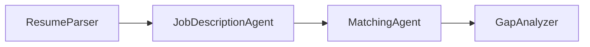

# Module 4 - Build the Four-Agent Workflow

⏱️ ~15 min

Replace the generated three-agent slogan chain with the strict Lab 02 workflow:



## Step 1: Create the four agents

Use the generated `FoundryChatClient`, then instantiate the agents with the
prompt constants added in Module 3:

```python
resume_parser = Agent(
    client=client,
    instructions=RESUME_PARSER_INSTRUCTIONS,
    name="ResumeParser",
    default_options={"store": False},
)
jd_agent = Agent(
    client=client,
    instructions=JOB_DESCRIPTION_INSTRUCTIONS,
    name="JobDescriptionAgent",
    default_options={"store": False},
)
matching_agent = Agent(
    client=client,
    instructions=MATCHING_AGENT_INSTRUCTIONS,
    name="MatchingAgent",
    default_options={"store": False},
)
gap_analyzer = Agent(
    client=client,
    instructions=GAP_ANALYZER_INSTRUCTIONS,
    name="GapAnalyzer",
    tools=[search_microsoft_learn_for_plan],
    default_options={"store": False},
)
```

Only `GapAnalyzer` gets the Microsoft Learn tool. Disabling response storage is a
workshop privacy control; synthetic data remains mandatory.

## Step 2: Create executors

```python
resume_executor = AgentExecutor(resume_parser, context_mode="last_agent")
jd_executor = AgentExecutor(jd_agent, context_mode="last_agent")
matching_executor = AgentExecutor(matching_agent, context_mode="last_agent")
gap_executor = AgentExecutor(gap_analyzer, context_mode="last_agent")
```

`context_mode="last_agent"` gives each stage only its immediate predecessor's
output. Labeled relays therefore preserve the minimum data needed downstream.

## Step 3: Build the workflow

```python
workflow_agent = (
    WorkflowBuilder(
        start_executor=resume_executor,
        output_executors=[gap_executor],
    )
    .add_edge(resume_executor, jd_executor)
    .add_edge(jd_executor, matching_executor)
    .add_edge(matching_executor, gap_executor)
    .build()
    .as_agent()
)
```

Keep `ResponsesHostServer(workflow_agent)` from the generated sample.

## Optional Careers enhancement

The [Careers@Gov MCP challenge](10-careers-mcp-challenge.md) later adds:

- `[SELECTED JOB KEY]`;
- one exact Careers `get_job` tool call;
- `[SOURCE JOB]` and `[SOURCE JOB PASS-THROUGH]`;
- untrusted-data handling;
- a conditional stop before scoring when job context is not verified.

Do not add those features until the original pasted-JD workflow passes locally.

### Checkpoint

- [ ] I replaced all three generated slogan agents.
- [ ] The graph has four agents and exactly three sequential edges.
- [ ] Every executor uses `context_mode="last_agent"`.
- [ ] Only `GapAnalyzer` has the Microsoft Learn tool.
- [ ] All agents use `default_options={"store": False}`.
- [ ] Resume and job-description content remain separated by labeled relays.
- [ ] `PersonalCareerCopilotCompleted/` was not used as a copy source.

---

**Previous:** [03 - Configure Agents & Environment](03-configure-agents.md) ·
**Next:** [05 - Test the Original Workflow Locally →](05-test-locally.md)
