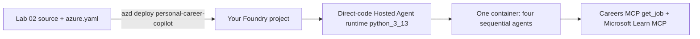

# Module 6 - Deploy to Foundry with `azd`

⏱️ ~15 min

Deploy the tested workflow as one direct-code Hosted Agent. Run this module from:

```bash
cd workshop/lab02-multi-agent
```

The checked-in [`azure.yaml`](../azure.yaml) contains one agent-only service and
no infrastructure. It uploads `PersonalCareerCopilot` to runtime `python_3_13`.



> [!IMPORTANT]
> Do not deploy from the old Lab 02 Foundry Toolkit/Agent Inspector wizard and do
> not use `agent.yaml`. Do not run `azd provision` or `azd up`: attendee
> `azure.yaml` has no infrastructure, and the shared MCP service is trainer-owned.
> The older Agent Inspector **Deploy** screenshot is obsolete for Lab 02.

## Prerequisites

- Your local selected-key and pasted-JD tests passed.
- You have an existing attendee-owned Foundry project and model deployment.
- You know both:
  - the Foundry project endpoint
  - the project's full ARM resource ID
- You have **Foundry Project Manager** on that project.
- Your model has available quota.
- The trainer-provided Careers endpoint/key are still valid.

## Step 1: Create or select an `azd` environment

Create a new environment:

```bash
AZURE_DEV_USER_AGENT=microsoft_foundry_skill \
  azd env new <your-lab02-environment-name> --no-prompt
```

Or select an environment you already created:

```bash
AZURE_DEV_USER_AGENT=microsoft_foundry_skill \
  azd env select <your-lab02-environment-name>
```

Use one environment per attendee/project combination. Every Lab 02 `azd`
command sets the required user-agent value inline; the variable name is exactly
`AZURE_DEV_USER_AGENT`.

## Step 2: Set non-secret deployment values

Replace every placeholder with values for **your** Foundry project:

```bash
AZURE_DEV_USER_AGENT=microsoft_foundry_skill \
  azd env set \
  AZURE_SUBSCRIPTION_ID=<your-subscription-id> \
  AZURE_LOCATION=<your-foundry-project-region> \
  AZURE_AI_PROJECT_ENDPOINT=https://<your-foundry-resource>.services.ai.azure.com/api/projects/<your-project> \
  FOUNDRY_PROJECT_ENDPOINT=https://<your-foundry-resource>.services.ai.azure.com/api/projects/<your-project> \
  AZURE_AI_PROJECT_ID='<full-ARM-resource-ID-of-your-foundry-project>' \
  AZURE_AI_MODEL_DEPLOYMENT_NAME=<your-model-deployment-name> \
  CAREERS_MCP_ENDPOINT=https://<trainer-provided-host>/mcp \
  CAREERS_MCP_TIMEOUT_SECONDS=10 \
  MICROSOFT_LEARN_MCP_ENDPOINT=https://learn.microsoft.com/api/mcp
```

`AZURE_AI_PROJECT_ENDPOINT` is used by the `azd` Foundry extension.
`FOUNDRY_PROJECT_ENDPOINT` is the matching local/runtime value. Set both to the
same URL. `AZURE_AI_PROJECT_ID` is the ARM project resource ID, not the HTTPS
endpoint and not a project display name. Do not use the trainer project or its
values.

## Step 3: Set the event key without placing it in the command text

```bash
read -rsp "Careers workshop API key: " CAREERS_KEY && echo
AZURE_DEV_USER_AGENT=microsoft_foundry_skill \
  azd env set CAREERS_MCP_API_KEY "$CAREERS_KEY"
unset CAREERS_KEY
```

The value comes from the trainer out of band. Never commit it or include it in a
screenshot.

## Step 4: Deploy only the Hosted Agent

```bash
AZURE_DEV_USER_AGENT=microsoft_foundry_skill \
  azd deploy personal-career-copilot --no-prompt
```

This is the only Lab 02 deployment command. The service name must match
[`azure.yaml`](../azure.yaml): `personal-career-copilot`.

## Step 5: Verify status

```bash
AZURE_DEV_USER_AGENT=microsoft_foundry_skill \
  azd ai agent show --output json
```

Confirm the deployed agent appears in your intended project and reaches a ready
state. If it is missing, failed, or targets the wrong project, do not invoke it;
see [Module 8](08-troubleshooting.md).

## Step 6: Invoke with the selected key

Reuse the exact key from Module 5:

```bash
AZURE_DEV_USER_AGENT=microsoft_foundry_skill \
  azd ai agent invoke personal-career-copilot \
  "Resume: Synthetic cloud engineer with four years of Python and Terraform experience. Selected Job Key: <paste-one-exact-key-from-search>"
```

Use synthetic data only. The deployed agent sends the exact key—not the
resume—to the shared Careers service.

### Checkpoint

- [ ] My `azd` environment targets my project endpoint and full ARM project ID.
- [ ] Subscription, location, both endpoint variables, ARM project ID, model,
      MCP endpoint/key, timeout, and Learn endpoint are present.
- [ ] Every `azd` command used `AZURE_DEV_USER_AGENT=microsoft_foundry_skill` inline.
- [ ] I ran only `azd deploy personal-career-copilot --no-prompt`.
- [ ] I did not run `azd provision`, `azd up`, trainer Bicep, or an Inspector deploy action.
- [ ] `azd ai agent show --output json` reports my Hosted Agent.
- [ ] Hosted invocation used a synthetic resume and an exact selected key.

---

**Previous:** [05 - Search & Test Locally](05-test-locally.md) ·
**Next:** [07 - Verify the Hosted Agent →](07-verify-in-playground.md)
