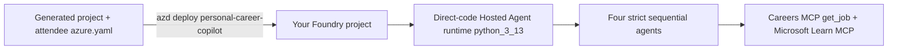

# Module 6 - Deploy to Foundry with `azd`

⏱️ ~15 min

Deploy the tested workflow as one direct-code Hosted Agent. Run this module from:

```bash
cd workshop/lab02-multi-agent/PersonalCareerCopilot
```

Module 2 copied `lab-assets/azure.attendee.yaml` into this generated project as
`azure.yaml`. It contains one agent-only service, no infrastructure, and uploads
`src/PersonalCareerCopilot` to runtime `python_3_13`.
The shared Careers MCP service is trainer-owned and is never deployed by
attendees.



## Prerequisites

- The original pasted-JD test passed locally.
- If you completed the Careers challenge, its selected-key/failure tests passed.
- You have an attendee-owned Foundry project and model deployment.
- You know the Foundry project endpoint and full ARM project resource ID.
- You have **Foundry Project Manager** on that project.
- Your model has quota for the four sequential model calls.
- The trainer-provided Careers endpoint/key are still valid.
- `azd` and the `azure.ai.agents` extension meet the version in `azure.yaml`.

### Package checklist

Do not loosen or replace the exact pins in
`src/PersonalCareerCopilot/requirements.txt`. Confirm it contains:

```text
agent-framework-foundry==1.10.4
agent-framework-foundry-hosting==1.0.0b260730
azure-identity==1.25.3
debugpy==1.8.21
httpx==0.28.1
mcp==1.29.0
opentelemetry-exporter-otlp-proto-grpc==1.43.0
python-dotenv==1.2.2
```

The hosting package serves the local `/responses` endpoint, `debugpy` enables
direct breakpoint attach, and the OTLP exporter supports privacy-safe optional
tracing. Their exact pins keep local diagnostics reproducible.

## Step 1: Confirm the generated `azd` environment

`azd ai agent init` created the local project/environment. Inspect it:

```bash
AZURE_DEV_USER_AGENT=microsoft_foundry_skill \
  azd env list
```

Use one environment per attendee/project combination. Do not run `azd init`
again; rerunning it can create duplicate services. Every command in this module
sets `AZURE_DEV_USER_AGENT=microsoft_foundry_skill` inline.

Do not run `azd env get-values` after configuring the event key; it can display
secret environment values.

## Step 2: Set all non-secret deployment values

Replace every placeholder with values from **your** Foundry project:

```bash
AZURE_DEV_USER_AGENT=microsoft_foundry_skill \
  azd env set \
  AZURE_SUBSCRIPTION_ID=<your-subscription-id> \
  AZURE_LOCATION=<your-foundry-project-region> \
  AZURE_AI_PROJECT_ENDPOINT=https://<your-foundry-resource>.services.ai.azure.com/api/projects/<your-project> \
  FOUNDRY_PROJECT_ENDPOINT=https://<your-foundry-resource>.services.ai.azure.com/api/projects/<your-project> \
  AZURE_AI_PROJECT_ID='<full-ARM-resource-ID-of-your-foundry-project>' \
  AZURE_AI_MODEL_DEPLOYMENT_NAME=<your-model-deployment-name> \
  CAREERS_MCP_ENDPOINT=https://<trainer-provided-host>/mcp \
  CAREERS_MCP_TIMEOUT_SECONDS=10 \
  MICROSOFT_LEARN_MCP_ENDPOINT=https://learn.microsoft.com/api/mcp
```

PowerShell:

```powershell
$env:AZURE_DEV_USER_AGENT = "microsoft_foundry_skill"
azd env set `
  AZURE_SUBSCRIPTION_ID=<your-subscription-id> `
  AZURE_LOCATION=<your-foundry-project-region> `
  AZURE_AI_PROJECT_ENDPOINT=https://<your-foundry-resource>.services.ai.azure.com/api/projects/<your-project> `
  FOUNDRY_PROJECT_ENDPOINT=https://<your-foundry-resource>.services.ai.azure.com/api/projects/<your-project> `
  AZURE_AI_PROJECT_ID='<full-ARM-resource-ID-of-your-foundry-project>' `
  AZURE_AI_MODEL_DEPLOYMENT_NAME=<your-model-deployment-name> `
  CAREERS_MCP_ENDPOINT=https://<trainer-provided-host>/mcp `
  CAREERS_MCP_TIMEOUT_SECONDS=10 `
  MICROSOFT_LEARN_MCP_ENDPOINT=https://learn.microsoft.com/api/mcp
Remove-Item Env:AZURE_DEV_USER_AGENT
```

The settings have distinct purposes:

| Setting | Purpose |
|---|---|
| `AZURE_SUBSCRIPTION_ID` | Attendee subscription containing the Foundry project |
| `AZURE_LOCATION` | Region of that project |
| `AZURE_AI_PROJECT_ENDPOINT` | Project endpoint consumed by the `azd` Foundry extension |
| `FOUNDRY_PROJECT_ENDPOINT` | Same endpoint consumed and validated by `main.py` at runtime |
| `AZURE_AI_PROJECT_ID` | Full ARM project resource ID, not a URL or display name |
| `AZURE_AI_MODEL_DEPLOYMENT_NAME` | Model deployment in the attendee project |
| `CAREERS_MCP_ENDPOINT` | Trainer-provided event service `/mcp` URL |
| `CAREERS_MCP_TIMEOUT_SECONDS` | Bounded Careers request timeout |
| `MICROSOFT_LEARN_MCP_ENDPOINT` | Official Learn MCP endpoint |

Never use the trainer's Foundry project, subscription, or model settings.

## Step 3: Set the event key without putting it in command history

On macOS/Linux:

```bash
bash
read -rsp "Careers workshop API key: " CAREERS_KEY && echo
AZURE_DEV_USER_AGENT=microsoft_foundry_skill \
  azd env set CAREERS_MCP_API_KEY "$CAREERS_KEY"
unset CAREERS_KEY
exit
```

On PowerShell:

```powershell
$careersKey = Read-Host "Careers workshop API key" -MaskInput
$env:AZURE_DEV_USER_AGENT = "microsoft_foundry_skill"
azd env set CAREERS_MCP_API_KEY $careersKey
Remove-Variable careersKey
Remove-Item Env:AZURE_DEV_USER_AGENT
```

The key comes from the trainer out of band. Never commit it or include it in a
screenshot.

## Step 4: Review the agent-only manifest

Confirm generated-project `azure.yaml` declares:

- service `personal-career-copilot`
- `host: azure.ai.agent`
- source project `src/PersonalCareerCopilot`
- direct-code runtime `python_3_13`
- entry point `main.py`
- `kind: hosted` and Responses protocol `2.0.0`
- model, Careers endpoint/key/timeout, and Learn endpoint runtime values
- no infrastructure provider

## Step 5: Deploy only the Hosted Agent

```bash
AZURE_DEV_USER_AGENT=microsoft_foundry_skill \
  azd deploy personal-career-copilot --no-prompt
```

PowerShell:

```powershell
$env:AZURE_DEV_USER_AGENT = "microsoft_foundry_skill"
azd deploy personal-career-copilot --no-prompt
Remove-Item Env:AZURE_DEV_USER_AGENT
```

This is the only Lab 02 deployment command. Do not run `azd provision`, `azd
up`, trainer Bicep, or any UI deployment action.

## Step 6: Verify status

```bash
AZURE_DEV_USER_AGENT=microsoft_foundry_skill \
  azd ai agent show personal-career-copilot --output table
```

Confirm the deployed agent appears in your intended project and reaches a ready
state. If it is missing, failed, or targets the wrong project, do not invoke it;
see [Module 8](08-troubleshooting.md).

> [!CAUTION]
> Do not display the full agent definition as JSON/YAML while the shared event
> key is configured. Hosted environment values can appear in that output.

## Step 7: Invoke

If you completed the Careers challenge, reuse the exact key from Module 5:

Reuse the exact key from Module 5:

```bash
AZURE_DEV_USER_AGENT=microsoft_foundry_skill \
  azd ai agent invoke personal-career-copilot --new-session \
  "Resume: Synthetic cloud engineer with four years of Python and Terraform experience. Selected Job Key: <paste-one-exact-key-from-search>"
```

Use synthetic data only. The deployed agent sends the exact key—not the
resume—to the shared Careers service.

If you skipped the optional challenge, invoke a new session with the synthetic
resume plus pasted job description used in Module 5.

### Checkpoint

- [ ] My `azd` environment targets my project endpoint and full ARM project ID.
- [ ] Subscription, location, both endpoint variables, ARM project ID, model,
      MCP endpoint/key, timeout, and Learn endpoint are present.
- [ ] Runtime, debugging, and OTLP package versions remain exactly pinned.
- [ ] Every `azd` command used `AZURE_DEV_USER_AGENT=microsoft_foundry_skill` inline.
- [ ] I ran only `azd deploy personal-career-copilot --no-prompt`.
- [ ] I did not deploy infrastructure or the trainer-owned Careers service.
- [ ] `azd ai agent show personal-career-copilot --output table` reports my Hosted Agent.
- [ ] Hosted invocation used a synthetic resume and an exact selected key.

---

**Previous:** [05 - Search & Test Locally](05-test-locally.md) ·
**Next:** [07 - Verify the Hosted Agent →](07-verify-in-playground.md)
