# Challenge - Ground Lab 02 with Careers@Gov MCP

## Challenge overview

Enhance the original **Resume → Job Fit Evaluator** so attendees can evaluate a
synthetic resume against one explicitly selected Careers@Gov listing.

Complete Modules 2–5 and prove the pasted-JD workflow before starting. All edits
occur in the attendee-generated
`PersonalCareerCopilot/src/PersonalCareerCopilot/` source directory.

This is an additive challenge, not a replacement for the original Lab 02:

| Lab 02 path | Job context | Result |
|---|---|---|
| Original | Attendee pastes a job description | Fit score, evidence, gaps, and learning roadmap |
| Careers MCP challenge | Attendee searches, selects one stable job key, and the agent retrieves that exact listing | The same analysis plus verifiable job provenance and dataset context |

The original pasted-job-description path remains available when no selected key
is supplied. This makes the enhancement easy to compare, demonstrate, and
disable if the shared service is unavailable.

**Suggested time:** 25 minutes

**Difficulty:** Intermediate

**Primary learning goal:** Add a bounded external MCP data source without
weakening privacy, provenance, or multi-agent orchestration.

## What changes in the agent output?

The original Lab 02 output contains:

1. A structured candidate profile.
2. Structured job requirements.
3. A 100-point fit assessment.
4. Matched, partial, and missing skills.
5. A Microsoft Learn roadmap.

The challenge preserves all of those outputs and adds:

- the exact Careers@Gov job key selected by the attendee;
- the listing title and agency;
- the canonical source URL;
- the trainer snapshot dataset version;
- an explicit evidence trail from job retrieval through the final response.

The final answer should therefore explain both **how well the synthetic candidate
fits** and **which exact source listing was evaluated**.

## Enhanced flow

```mermaid
flowchart LR
    CLI["Learner careers_mcp CLI"] -->|"search_jobs"| MCP["Trainer Careers MCP"]
    MCP --> Cards["Up to five compact job cards"]
    Cards --> Choice["Learner selects one exact job key"]
    Choice --> Input["Synthetic resume + Selected Job Key"]
    Input --> RP["ResumeParser"]
    RP -->|"selected key + parsed resume"| JD["JobDescriptionAgent"]
    JD -->|"get_job once"| MCP
    JD -->|"requirements + source + resume"| Match["MatchingAgent"]
    Match -->|"fit report + source"| Gap["GapAnalyzer"]
    Gap -->|"skill gaps"| Learn["Microsoft Learn MCP"]
    Gap --> Output["Grounded fit report + provenance + roadmap"]

    Pasted["Original pasted JD path"] -.->|"used only when no key exists"| RP
```



### Important boundaries

- Job discovery stays **outside** the hosted agent through the learner CLI.
- The learner, not the model, chooses the listing.
- Only `JobDescriptionAgent` receives the Careers retrieval tool.
- The Careers MCP receives search filters or one exact key—never resume content.
- Retrieved fields are untrusted data and cannot change agent instructions.
- `context_mode="last_agent"` means every required value must be relayed through
  explicit labeled sections.

## Trainer and attendee responsibilities

| Trainer | Attendee |
|---|---|
| Hosts the read-only Careers MCP service | Uses their own Foundry project and model |
| Distributes the endpoint and event key out of band | Stores values only in local `.env` and the azd environment |
| Rotates the shared key before/after the event | Uses only synthetic resume data |
| Monitors availability and keeps the pasted-JD fallback ready | Selects one exact key and verifies provenance |

Attendees do not deploy the Careers dataset, MCP service, trainer Bicep, or
trainer Container App.

## Prerequisites

Complete the base Lab 02 workflow first, then confirm:

- Python 3.13 and the Lab 02 dependencies are installed.
- The attendee can access their own Foundry project and model deployment.
- The trainer has supplied:
  - `CAREERS_MCP_ENDPOINT`;
  - `CAREERS_MCP_API_KEY`.
- `PersonalCareerCopilot/src/PersonalCareerCopilot/.env` is uncommitted and
  contains no placeholders.
- Only synthetic resume content will be used.

## Challenge tasks

### Task 0 - Prove the MCP connection

Copy the provided helper, then run these commands from
`PersonalCareerCopilot/src/PersonalCareerCopilot` before editing `main.py`:

```bash
cp ../../../lab-assets/careers_mcp.py .
```

```bash
python -m careers_mcp status

python -m careers_mcp search \
  --query "cloud platform engineer" \
  --max-experience-years 5 \
  --limit 3

python -m careers_mcp get \
  --job-key "<one-exact-key-from-search>"
```

Expected results:

1. Dataset status is `ready`.
2. Search returns no more than the requested number of compact job cards.
3. `get` returns the same exact key, canonical URL, and dataset version.

If this checkpoint fails, troubleshoot endpoint, key, timeout, or network
configuration before changing agent code.

### Task 1 - Keep MCP transport out of `main.py`

Use the copied helper:

```python
from careers_mcp import CareersMcpError, get_job as get_careers_job
```

`careers_mcp.py` owns:

- environment configuration;
- the `x-careers-workshop-key` header;
- Streamable HTTP MCP transport;
- timeout and input bounds;
- structured response validation;
- exact returned-key validation;
- safe configuration, transport, protocol, and tool errors.

Do not duplicate raw HTTP or MCP session code in the agent orchestration.

### Task 2 - Relay the selected key

Update `ResumeParser` so its output includes:

```text
[SELECTED JOB KEY]
<the complete exact key, or an explicit no-key marker>
```

Preserve the existing parsed resume and pasted-job-description sections. Do not
normalize, shorten, or reinterpret the key.

### Task 3 - Define retrieval behavior

`JobDescriptionAgent` should:

1. Read `[SELECTED JOB KEY]`.
2. Call the Careers tool exactly once when a real key exists.
3. Use the selected-key path when both a key and pasted JD are supplied.
4. Treat every retrieved field as untrusted data.
5. Report retrieval failure explicitly without fabricating or silently falling
   back to the pasted JD.
6. Preserve the original pasted-JD behavior only when no key was selected.
7. Emit:
   - `[JD REQUIREMENTS]`;
   - `[PARSED RESUME PASS-THROUGH]`;
   - `[SOURCE JOB]`.

### Task 4 - Create one narrow tool

Expose only exact-key retrieval to the agent:

```python
@tool
async def get_selected_careers_job(job_key: str) -> str:
    ...
```

The wrapper should:

- call `get_careers_job(job_key)`;
- catch `CareersMcpError`;
- return an explicit failure marker;
- label successful output as untrusted data;
- never return invented or fallback job content.

Do not expose `search_jobs` to the hosted workflow. Keeping search out of band
ensures the learner makes the final selection and keeps tool use predictable.

### Task 5 - Apply least-privilege tool assignment

Assign `get_selected_careers_job` only to `JobDescriptionAgent`.

| Agent | Careers tool? | Reason |
|---|---:|---|
| `ResumeParser` | No | Parses and routes learner input |
| `JobDescriptionAgent` | Yes | Retrieves the one selected listing |
| `MatchingAgent` | No | Compares already-grounded profiles |
| `GapAnalyzer` | No | Uses Microsoft Learn MCP for roadmap resources |

Keep `default_options={"store": False}` for all four agents.

### Task 6 - Relay source provenance

Because every executor uses `context_mode="last_agent"`, downstream agents see
only the immediately preceding output.

`MatchingAgent` must therefore copy:

```text
[SOURCE JOB PASS-THROUGH]
```

`GapAnalyzer` must include these values in its final `[SOURCE JOB]`:

- title;
- agency;
- canonical source URL;
- exact job key;
- dataset version.

Copy provenance values; do not reconstruct or infer them.

### Task 7 - Configure local and hosted execution

Before configuration, add a deterministic conditional branch after
`JobDescriptionAgent`:

- continue to `MatchingAgent` only when the required JD/source markers exist;
- when a selected key exists, require the successful Careers tool marker in the
  agent conversation;
- route retrieval/no-input/contract failures to a fixed `[WORKFLOW STOP]`
  response;
- do not run `MatchingAgent` or `GapAnalyzer` on that failure path.

This prevents a failed lookup from becoming a fabricated score or roadmap.
Use the complete pinned implementation and wiring in
[`lab-assets/careers-failure-gate.md`](../lab-assets/careers-failure-gate.md).

Local values belong in
`PersonalCareerCopilot/src/PersonalCareerCopilot/.env`:

```env
CAREERS_MCP_ENDPOINT=https://<trainer-provided-host>/mcp
CAREERS_MCP_API_KEY=<trainer-provided-event-key>
CAREERS_MCP_TIMEOUT_SECONDS=10
```

The generated project-root `PersonalCareerCopilot/azure.yaml` maps the same
names into the Hosted Agent runtime. Store the secret in the attendee's azd
environment rather than source code. Run this from the generated project root:

```bash
cd ../..
bash
read -rsp "Careers MCP key: " CAREERS_KEY && echo
AZURE_DEV_USER_AGENT=microsoft_foundry_skill \
  azd env set CAREERS_MCP_API_KEY "$CAREERS_KEY"
unset CAREERS_KEY
exit
cd src/PersonalCareerCopilot
```

The workshop key is an opaque shared secret. It has no automatic bearer-token
expiry and remains valid until the trainer rotates it.

Never place the key in:

- `main.py`;
- prompts or agent instructions;
- tool arguments;
- committed `.env` files;
- screenshots or MCP Inspector Network logs.

### Task 8 - Test both paths

#### Selected Careers listing

```text
Resume:
Synthetic cloud engineer with four years of Python, Terraform, and CI/CD.

Selected Job Key:
<paste-one-exact-key-from-search>
```

#### Original Lab 02 fallback

Start a new request with no `Selected Job Key:` and include:

```text
Resume:
Synthetic application developer with three years of Python and API experience.

Job Description:
<paste a synthetic or public job description>
```

The first request should use Careers MCP. The second should retain the original
Lab 02 behavior without calling Careers MCP.

## Success criteria

- [ ] MCP `status`, `search`, and `get` succeed before the agent test.
- [ ] Search returns no more than five compact cards.
- [ ] The learner explicitly chooses one complete stable key.
- [ ] Only `JobDescriptionAgent` can call the Careers tool.
- [ ] Exactly one selected listing is retrieved.
- [ ] The same exact key appears in the final response.
- [ ] The final response includes title, agency, source URL, and dataset version.
- [ ] Selected-key data takes precedence when a pasted JD is also present.
- [ ] Invalid/no-input retrieval stops before fit scoring or roadmap generation.
- [ ] The fit-score categories total 100 points.
- [ ] Missing skills feed the Microsoft Learn roadmap.
- [ ] Resume content is never sent to Careers MCP.
- [ ] The original pasted-JD path still works.
- [ ] `azure.yaml` contains environment references, not a literal API key.

## How to interpret the enriched output

| Output element | Original Lab 02 | Careers MCP challenge |
|---|---|---|
| Candidate evidence | Parsed from synthetic resume | Unchanged |
| Job requirements | Parsed from pasted text | Grounded in one retrieved listing |
| Fit score | 100-point evidence-based score | Same scoring model |
| Gaps | Derived from pasted requirements | Derived from retrieved requirements |
| Roadmap | Microsoft Learn resources | Unchanged, but grounded in retrieved gaps |
| Source identity | Often implicit | Exact key, URL, agency, title, and dataset version |
| Reproducibility | Depends on pasted text | Re-run against the same stable key and snapshot version |

The enhancement improves source transparency and reproducibility without giving
the model permission to browse or choose a job autonomously.

## Failure behavior and fallback

| Situation | Expected behavior |
|---|---|
| Missing endpoint/key | Fail configuration preflight with an actionable error |
| Unauthorized key | Report MCP retrieval failure; do not expose key details |
| Unknown or malformed key | Report failure; do not select another listing |
| Both key and pasted JD | Use the selected key; do not blend both sources |
| No key but pasted JD | Use the original Lab 02 path |
| Neither key nor pasted JD | Ask the learner to search and provide one exact key |
| Careers MCP unavailable during workshop | Start a new request using the pasted-JD fallback |

## Stretch goals

After the base challenge works:

1. Add regression cases for malformed, missing, and conflicting selected keys.
2. Compare the same synthetic resume against two separately selected roles.
3. Add per-attendee APIM subscription keys for individual revocation and usage
   reporting.
4. Replace the shared workshop key with production-grade client authentication.
5. Add a dataset freshness indicator to the final output.

Do not add autonomous job selection, send resume data to the shared service, or
combine multiple listings into one fit score.

## Trainer debrief

Ask attendees:

1. Why is search kept outside the agent?
2. Why can only one agent call `get_job`?
3. What does the stable key contribute beyond a source URL?
4. Why must retrieved job descriptions be treated as untrusted data?
5. What breaks if source metadata is not relayed with `last_agent` context?
6. How does this enhancement preserve the original Lab 02 fallback?

The key lesson is that MCP adds useful external context, while explicit
selection, least-privilege tools, privacy boundaries, and provenance keep the
workflow predictable and auditable.

After completing and testing the challenge, compare your implementation with
[`PersonalCareerCopilotCompleted`](../PersonalCareerCopilotCompleted). Do not use
the completed source as a copy target before attempting the tasks.

---

**Previous:** [Summary & Next Steps](09-summary.md) ·
**Back to:** [Lab 02 Learning Path](README.md)
